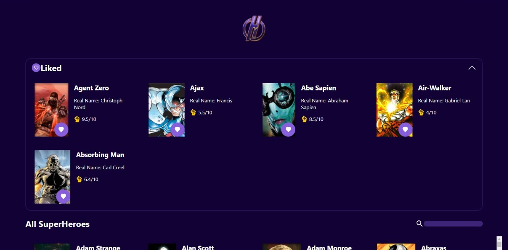
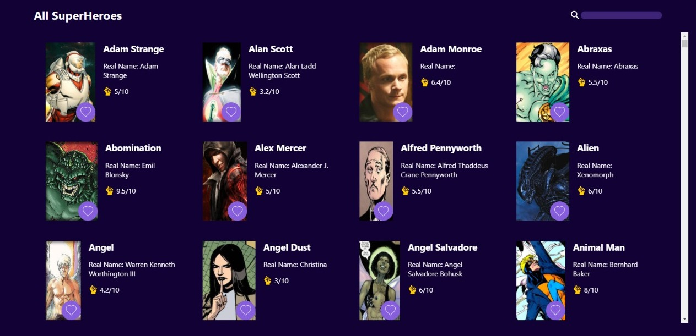

# Super Hero APP

Choose your favorites superheroes in Super Hero APP. Using react window library to render the necessary cards in the UI

npm install to add node modules and libraries - npm start to run this proyect

- React JS
- React Window
- Reducers
- CSS
- Material UI
- Local Storage
- Rest API's
- BEM CSS methodology

API URL: https://akabab.github.io/superhero-api/api/all.json

## Favorite Section

## General Section

<<<<<<< HEAD

=======

> > > > > > > fb2f18fe4c5bf312c977b706e4bb4567b3e25829
