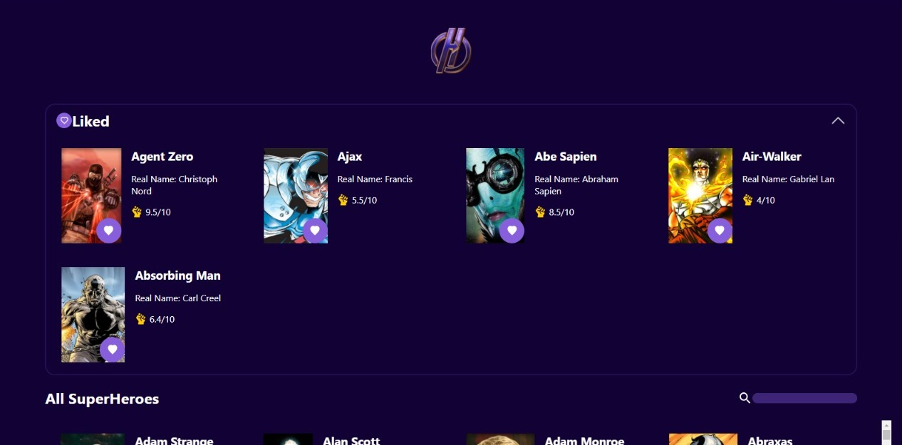
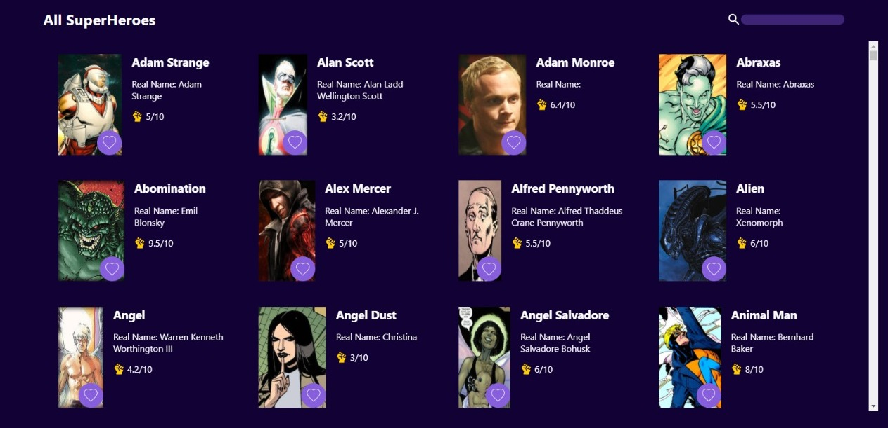

# Super Hero APP

Choose your favorites superheroes in Super Hero APP. Using react window library to render the necessary cards in the UI

When you add a superhero to your favorites list, it will be removed from the general list , and also, if you remove a superhero from your favorites list, it will be added to the general list

- React JS
- React Window
- Reducers
- CSS
- Material UI
- Local Storage
- Rest API's

API URL: https://akabab.github.io/superhero-api/api/all.json

# Favorite Section

# General Section

